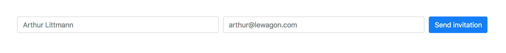

# From Bootstrap v3 to v4

The new version of Bootstrap (4.0) has brought a lot of awesome new things, like an improved grid system for perfect responsiveness with 5 breakpoints (xs, sm, md, lg, xl), a flexbox system for complex layouts, many new utility classes that allow you to build you the design of you project in no time and much more!

If you are used to previous version of Bootstrap (3.3 or lower) it can be a little disorienting to migrate to the newest version with all these changes. This articles aims to show you how to use the Bootstrap version 4.0 if you are used to 3.3 or lower.

## Making an image circle

If you want to make your element a circle, like turning a square image into an avatar, you can now use `rounded-circle`.


Bootstrap v4:
```html

```

Bootstrap v3:
```html

```


## Display on different devices

The display utility classes have changed a lot in the new version. To hide elements you can now use `d-none` (when no screen size it's `xs` by default) or `d-{screen-size}-none`

Bootstrap v3:

```html
<div class="hidden-xs"></div>
<div class="hidden-lg"></div>
```

Bootstrap v4:

```html
<div class="d-none"></div>
<div class="d-lg-none"></div>
```

Other common types of display can be used in the same syntax:

<ul>
  <li><code>none</code></li>
  <li><code>inline-block</code></li>
  <li><code>block</code></li>
  <li><code>flex</code></li>
</ul>

Example: How to display a certain `div` on phone &amp; tablet and display another one on larger screens?

```html
<div class="d-sm-none">Display this on screens small than sm (phone and tablet)</div>
<div class="d-none d-sm-block">Display this on screens larger than sm</div>
```

## Align your text

Text alignement classes haven't changed much but the cool thing is that you can now change the alignement on different devices!

```html
<p class="text-left">Left aligned text.</p>
<p class="text-center">Center aligned text.</p>
<p class="text-right">Right aligned text.</p>

<p class="text-left text-md-center">Left aligned text small devices (xs, sm), but centered on wider ones.</p>
```

## The Grid

The grid is the ultimate weapon to make your websites responsive with very little setup, the newest version of Bootstrap comes with a highly improved grid system, including the fact that `.row`s are now `flexbox`es by default!

### Basics

Lets take this simple example, we would like `col`umns to take all the screen width of a small device but take 1/3 of the screen on larger devices.


Bootstrap v3:

```html
<div class="container">
  <div class="row">
    <div class="col-xs-12 col-md-4">
      ...
    </div>
    <div class="col-xs-12 col-md-4">
      ...
    </div>
    <div class="col-xs-12 col-md-4">
      ...
    </div>
  </div>
</div>
```

Bootstrap v4:

```html
<div class="container">
  <div class="row">
    <div class="col-12 col-md-4">
      ...
    </div>
    <div class="col-12 col-md-4">
      ...
    </div>
    <div class="col-12 col-md-4">
      ...
    </div>
  </div>
</div>
```

Here's how the new version works:

<ul>
  <li><code>col-</code> for extra small device (smaller than 576px)</li>
  <li><code>col-sm</code> for small device (greater than 576px)</li>
  <li><code>col-md</code> for medium device (greater than 768px)</li>
  <li><code>col-lg</code> for large device (greater than 992px)</li>
  <li><code>col-xl</code> for extra large device (greater than 1200px)</li>
</ul>

### Equal width columns


When doing equal width column you can now do the following:

Bootstrap v3:

```html
<div class="container">
  <div class="row">
    <div class="col-xs-6">
      1 of 2
    </div>
    <div class="col-xs-6">
      2 of 2
    </div>
  </div>
  <div class="row">
    <div class="col-xs-4">
      1 of 3
    </div>
    <div class="col-xs-4">
      2 of 3
    </div>
    <div class="col-xs-4">
      3 of 3
    </div>
  </div>
</div>
```

Bootstrap v4:

```html
<div class="container">
  <div class="row">
    <div class="col">
      1 of 2
    </div>
    <div class="col">
      2 of 2
    </div>
  </div>
  <div class="row">
    <div class="col">
      1 of 3
    </div>
    <div class="col">
      2 of 3
    </div>
    <div class="col">
      3 of 3
    </div>
  </div>
</div>
```

### Aligning columns

The grid now uses `flexbox`, this means that if you want to align it you can use the newest `flexbox` utility classes on a `.row`.


Bootstrap v3:

```html
<div class="container">
  <div class="row">
    <div class="col-md-4 col-md-offset-4">...</div>
  </div>
</div>
```

Bootstrap v4:

1. Using offset

  ```html
  <div class="container">
    <div class="row">
      <div class="col-md-4 offset-md-4">...</div>
    </div>
  </div>
  ```

2. Using flexbox

  ```html
  <div class="container">
    <div class="row justify-content-center">
      <div class="col-md-4">...</div>
    </div>
  </div>
  ```

## Making an inline form

The `.form-inline` has been dropped in the newest version, instead you can now use `.form-row`, a variation of our standard grid row. This means that first of all you can easily make complex form layout using your knowledge of the grid, but you can also easily modify the width that `input`s take using different size colums!



Bootstrap v3:

```html
<form action="..." class="form-inline">
  <div class="form-group">
    <input type="text" class="form-control" placeholder="Arthur Littmann">
  </div>
  <div class="form-group">
    <input type="email" class="form-control" placeholder="arthur@lewagon.com">
  </div>
  <button type="submit" class="btn btn-primary">Send invitation</button>
</form>
```

Bootstrap v4:

```html
<form action="...">
  <div class="form-row">
    <div class="col-5 form-group">
      <input type="text" class="form-control" placeholder="Arthur Littmann">
    </div>
    <div class="col-5 form-group">
      <input type="email" class="form-control" placeholder="arthur@lewagon.com">
    </div>
    <div class="col-2 form-group">
      <button type="submit" class="btn btn-primary">Send invitation</button>
    </div>
  </div>
</form>
```

