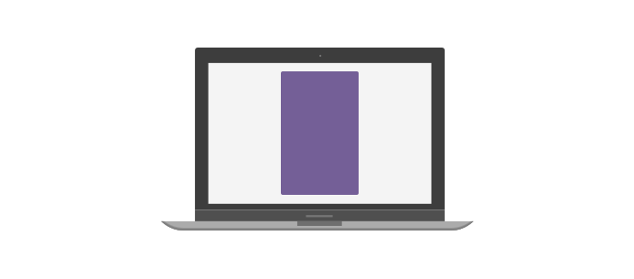

# Bootstrap v4, what's new?

INTRO

## What's new ?

1. **The default font-size increased from 14px to 16px.**

2. **The primary CSS unit used is now `rem` (used to be `px`).**
    The `rem` unit sets the size relative to the base font-size (if base font-size is `16px`, `2rem` would be `32px`). Although pixels are still used for media queries and grid behavior as device viewports are not affected by type size.

3. **The Grid now uses flexbox by default with some vertical and horizontal alignment classes.**

4. **New breakpoint for responsive grid.**
    ```sass
    $grid-breakpoints: (
        xs: 0px,
        sm: 576px,
        md: 768px,
        lg: 992px,
        xl: 1200px
    );
    ```
## Utility classes

### Borders

Want to add borders to you elements ? You can now use the new `border` utility classes like this:

```html
<!-- Add border all round the div -->
<div class="border"></div>

<!-- Only add a border on top of the div (can also be used with 'right', 'left', 'bottom') -->
<div class="border-top"></div>

<!-- Add border with 'primary' color all round the div -->
<div class="border border-primary"></div>

```

### Border radius

If you want to make your element a circle (like an avatar), you can now use `rounded-circle`.

Bootstrap v3:

```html

```

Bootstrap v4:
```html

```

### Display

The display utility classes have changed a lot in the new version. To hide elements you can now use `d-none` (when no screen size it's `xs` by default) or `d-{screen-size}-none`

Bootstrap v3:

```html
<div class="hidden-xs"></div>
<div class="hidden-lg"></div>
```

Bootstrap v4:

```html
<div class="d-none"></div>
<div class="d-lg-none"></div>
```

Other common types of display can be used in the same syntax:

<ul>
  <li><code>none</code></li>
  <li><code>inline-block</code></li>
  <li><code>block</code></li>
  <li><code>flex</code></li>
</ul>


Example: How to display a certain `div` on phone &amp; tablet and display another one on larger screens?

```html
<div class="d-sm-none">Display this on screens small than sm (phone and§ tablet)</div>
<div class="d-none d-sm-block">Display this on screens larger than sm</div>
```

### Flexbox

Making flexboxes has never been easier with the new `flex` utility classes!

```html
<div class="d-flex">
  <div>...</div>
  <div>...</div>
</div>
```

Then you can horizontaly align your items with `justify-content-{value}` classes

```html
<div class="d-flex justify-content-between">
  <div>...</div>
  <div>...</div>
</div>
```

Other common `justify-content` properties can be used like this:
<ul>
  <li><code>.justify-content-start</code></li>
  <li><code>.justify-content-end</code></li>
  <li><code>.justify-content-center</code></li>
  <li><code>.justify-content-between</code></li>
  <li><code>.justify-content-around</code></li>
</ul>

You can also align vertically with `align-items-{value}` classes

```html
<div class="d-flex align-items-center">
  <div>...</div>
  <div>...</div>
</div>
```

Other common `align-items` properties can be used like this:
<ul>
  <li><code>.align-items-start</code></li>
  <li><code>.align-items-end</code></li>
  <li><code>.align-items-center</code></li>
  <li><code>.align-items-baseline</code></li>
  <li><code>.align-items-stretch</code></li>
</ul>

And you can also use change these property on different screen sizes with `.justify-content-{screen-size}-{value}` or `.align-items-{screen-size}-{value}` (Example `.justify-content-lg-center`).

For more information don't hesitate to check out [Bootstrap v4's flex documention](https://getbootstrap.com/docs/4.1/utilities/flex/)

### Position

Quick positioning classes are now available (although they are not responsive).

```html
<div class="fixed-top">...</div>
<div class="fixed-bottom">...</div>
<div class="sticky-top">...</div>
```

### Sizing

It's now easy make an element as wide or as tall (relative to its parent) with our width and height utilities like `w-{size}` or `h-{size}`.

```html
<div style="width: 100px; height: 100px">

  <div class="w-50">
    This is 50% width relative to parent (50px)
  </div>

  <div class="h-25">
    This is 25% height relative to parent (25px)
  </div>

</div>
```

### Spacing

The classes are named using the format `{property}{sides}-{size}` for xs and `{property}{sides}-{breakpoint}-{size}` for sm, md, lg, and xl.

Property can be:
<ul>
  <li><code>m</code> for margin</li>
  <li><code>p</code> for padding</li>
</ul>

Sides can be:
<ul>
  <li><code>t</code> for top</li>
  <li><code>b</code> for bottom</li>
  <li><code>l</code> for left</li>
  <li><code>r</code> for right</li>
  <li><code>x</code> for right &amp; left</li>
  <li><code>y</code> for top &amp; bottom</li>
</ul>

Sizes can be:

<ul>
  <li><code>0</code> for setting margin or padding to <code>0</code></li>
  <li><code>1</code> for setting margin or padding to <code>0.25rem</code></li>
  <li><code>2</code> for setting margin or padding to <code>0.5rem</code></li>
  <li><code>3</code> for setting margin or padding to <code>1rem</code></li>
  <li><code>4</code> for setting margin or padding to <code>1.5rem</code></li>
  <li><code>5</code> for setting margin or padding to <code>3rem</code></li>
  <li><code>auto</code> for setting margin or padding <code>auto</code></li>
</ul>

### Text

Text alignement classes haven't changed much but the cool thing is that you can now change the alignement on different devices!

```html
<p class="text-left">Left aligned text.</p>
<p class="text-center">Center aligned text.</p>
<p class="text-right">Right aligned text.</p>

<p class="text-left text-md-center">Left aligned text small devices (xs, sm), but centered on wider ones.</p>
```

## The Grid

The grid is the ultimate weapon to make your websites responsive with very little setup, the newest version of Bootstrap comes with a highly improved grid system, including the fact that `.row`s are now `flexbox`es by default!

### Basics

Lets take this simple example, we would like `col`umns to take all the screen width of a small device but take 1/3 of the screen on larger devices.


```html
<div class="container">
  <div class="row">
    <div class="col-12 col-md-4">
      ...
    </div>
    <div class="col-12 col-md-4">
      ...
    </div>
    <div class="col-12 col-md-4">
      ...
    </div>
  </div>
</div>
```

The new grid system now comes with 5 different breakpoints:

<ul>
  <li><code>col-</code> for extra small device (smaller than 576px)</li>
  <li><code>col-sm</code> for small device (bigger than 576px)</li>
  <li><code>col-md</code> for medium device (smaller than 768px)</li>
  <li><code>col-lg</code> for large device (smaller than 992px)</li>
  <li><code>col-xl</code> for extra large device (smaller than 1200px)</li>
</ul>

### Equal width columns


When doing equal width column you can now do the following:

```html
<div class="container">
  <div class="row">
    <div class="col">
      1 of 2
    </div>
    <div class="col">
      2 of 2
    </div>
  </div>
  <div class="row">
    <div class="col">
      1 of 3
    </div>
    <div class="col">
      2 of 3
    </div>
    <div class="col">
      3 of 3
    </div>
  </div>
</div>
```

### Aligning columns

The grid now uses `flexbox`, this means that if you want to align it you can use the newest `flexbox` utility classes on a `.row`.



1. Using offset

  ```html
  <div class="container">
    <div class="row">
      <div class="col-md-4 offset-md-4">...</div>
    </div>
  </div>
  ```

2. Using flexbox

  ```html
  <div class="container">
    <div class="row justify-content-center">
      <div class="col-md-4">...</div>
    </div>
  </div>
  ```
